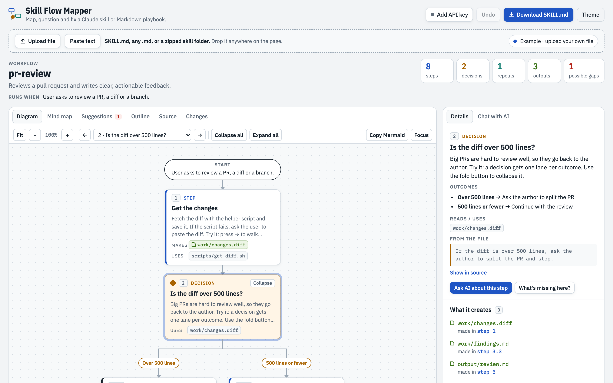

# Skill Flow Mapper

Upload a Claude skill (`SKILL.md`, or a zipped skill folder) or any Markdown playbook and see the whole workflow at once:

- **Diagram**: every step in order, decision points with one lane per outcome, loops, and the files each step creates. You can pan, zoom, collapse branches and step through with ← / →.
- **Mind map**: the skill name in the centre with its steps, branches and outputs around it. Links between steps that pass data are drawn automatically, and you can drag from a dot to add your own links.
- **Suggestions**: gaps such as "it says what to do if X exists, but not if it doesn't", missing failure handling, loops with no end and missing files. Each gap has a one-click fix.
- **Chat with AI** (Claude, ChatGPT or Gemini): ask about one step or the whole flow. When you ask for a fix, the AI edits the file and the diagram redraws. Undo is always available.
- **Changes**: the net diff of everything you or the AI changed since upload, with line numbers. Copy it, download it as a `.patch`, or restore the original file.
- **Export** the diagram or mind map as a PNG or SVG image (the whole view, whatever the zoom), or copy the flow as Mermaid code.
- **Download** the updated `.md`, or a `.zip` for multi-file skills.

The page opens with an example skill (a pull request review). Each of its steps shows off one feature, so clicking through them is a quick tour of the app.

[](https://github.com/m0rath/skill-flow/actions/workflows/ci.yml)



The app is fully static: HTML, CSS and native ES modules, plus a vendored copy of JSZip and self-hosted fonts. There is no build step and no backend. Everything in `public/` is the site.

## Try It Online

No installation required. You can access the live, hosted version of the tool here:
[justools.in](https://justools.in/)

The hosted version provides direct access to the available tools in your browser.
You just need the api key, google gemini offers it for free [here](https://aistudio.google.com/apikey?_gl=1*329ebo*_ga*MjgyNjg4MzU1LjE3OTA3NjA0NjQ.*_ga_P1DBVKWT6V*czE3OTA3NjA0NjMkbzEkZzAkdDE3OTA3NjA0NjgkajU1JGwwJGgyMTQyMzMyNjI2)

## Run locally

You need Node.js 20 or newer (only for the dev server and tooling).

```bash
npm install
npm start
# then open http://localhost:8000
```

ES modules don't load from `file://`, so serve the folder instead of opening `index.html` directly. Any static server works, for example `python3 -m http.server -d public 8000`.

## Development

```bash
npm run lint          # ESLint
npm run format        # Prettier (write)
npm run format:check  # Prettier (check only)
npm test              # unit tests (node --test)
npm run check         # all of the above; this is what CI runs
```

See [CONTRIBUTING.md](CONTRIBUTING.md) for guidelines.

## Project structure

```
public/                    the deployable site (publish this folder)
  index.html               markup only; no inline scripts or style blocks
  _headers                 security headers for Netlify / Cloudflare Pages
  .nojekyll                tells GitHub Pages to serve files as-is
  favicon.svg  og-image.png
  vendor/jszip.min.js      JSZip 3.10.1 (reads and writes .zip skill folders)
  assets/
    css/                   fonts · base (tokens, themes) · layout · diagram · mindmap · panels · chat
    fonts/                 IBM Plex, latin subset (SIL Open Font License)
    js/
      main.js              entry point: wires up modules and boots the app
      state.js             shared app state and localStorage persistence
      lib/                 small pure helpers (escaping, DOM, Markdown, loose JSON, line diff)
      data/                the built-in example skill
      model/               parsing and analysis, no DOM (quick parser, normaliser, checks, Mermaid export)
      ui/                  views: diagram, mind map, outline, source, changes, suggestions, side panel, pan/zoom, image export
      app/                 file upload / download and undo history
      ai/                  providers, prompts, AI mapping, chat and edit application, settings
tests/                     unit tests for model/, lib/ and ai/ helpers
docs/                      README images
scripts/serve.js           zero-dependency dev server
.github/workflows/         CI (lint, format, test) and Netlify deploy
netlify.toml               Netlify config (publish public/, no build)
```

## AI features: bring your own key

Chat, AI mapping and the gap review work with any of three providers. Each user picks one under **AI settings** in the app and adds their own key:

| Provider           | Get a key                                                            | Free option                                                                           |
| ------------------ | -------------------------------------------------------------------- | ------------------------------------------------------------------------------------- |
| Anthropic (Claude) | [console.anthropic.com](https://console.anthropic.com/settings/keys) | No free tier; new accounts may get a small trial credit                               |
| OpenAI (ChatGPT)   | [platform.openai.com](https://platform.openai.com/api-keys)          | No; API usage is billed separately from ChatGPT Plus                                  |
| Google Gemini      | [aistudio.google.com](https://aistudio.google.com/app/apikey)        | Yes, a rate-limited free tier (on it, Google may use prompts to improve its products) |

- **Where the key goes:** the browser calls the chosen provider directly (`api.anthropic.com`, `api.openai.com` or `generativelanguage.googleapis.com`). The key is never sent anywhere else. The page's Content Security Policy only allows network connections to those three hosts.
- **Where keys are kept:** by default only for the current tab (sessionStorage). If the user ticks **Remember keys on this device**, they're kept in this browser's localStorage. Each provider's key is stored separately, and **Remove this key** deletes one.
- **Models:** **Test key** lists the models the key can use, straight from the provider, so the list stays current. You can also type any model ID.
- **Quality:** turning a skill into a diagram needs a model that returns clean structured JSON. Larger models (Claude Sonnet or Opus, a full-size GPT model, Gemini Pro or Flash) do this well. Very small models may produce rougher diagrams and fixes.
- **Cost:** usage is billed to the key owner. Set a spend limit with your provider.
- **Without a key:** the diagram, mind map, quick checks, outline, source editing and download all work offline. They use a built-in parser that is less accurate than a model.

### Security notes for shared deployments

- Anyone who can run JavaScript on the page could read a key stored there. Host only on a domain you control, and keep third-party scripts to a minimum. The only one is Google Analytics, and only when a measurement ID is set at deploy time. Uploaded file content is always escaped, never run.
- For a team deployment where people shouldn't handle raw keys, put a small proxy (for example a Netlify Function or Cloudflare Worker) in front of the provider. The proxy holds the key and checks users, and the request URLs in `REQ` in `public/assets/js/ai/providers.js` point at it. The app doesn't include a proxy.
- Check your organization's policy on API keys in browsers before sharing the link widely.

## Customizing

- **Prompts:** `public/assets/js/ai/prompts.js` (`mapPrompt`, `chatInstructions`, `reviewPrompt`).
- **Providers:** request formats, model listing and default model choice are in `public/assets/js/ai/providers.js`.
- **Colors:** CSS variables at the top of `public/assets/css/base.css`, with separate light and dark values.
- **Quick parser** (used without an API key): `public/assets/js/model/quick-parse.js`.
- **Example skill** shown on first visit: `public/assets/js/data/example.js`.
- **Social preview:** replace `public/og-image.png`. If you deploy under another domain, change `og:url` and `og:image` in `public/index.html`; link previews need absolute URLs.
- **New external hosts** (for example a proxy or another provider): add them to `connect-src` in both the CSP `<meta>` tag in `public/index.html` and `public/_headers`.

## License

[MIT](LICENSE). Bundled third-party files keep their own licenses:

- JSZip: MIT or GPLv3 (`public/vendor/JSZIP-LICENSE.md`)
- IBM Plex fonts: SIL Open Font License 1.1 (`public/assets/fonts/OFL.txt`)

See also [CONTRIBUTING.md](CONTRIBUTING.md), [SECURITY.md](SECURITY.md), [CODE_OF_CONDUCT.md](CODE_OF_CONDUCT.md) and [CHANGELOG.md](CHANGELOG.md).
